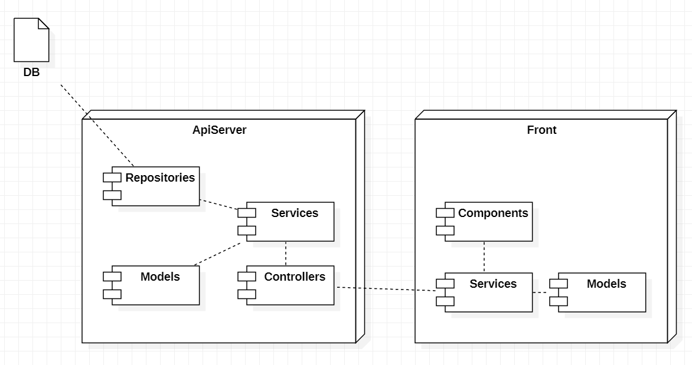
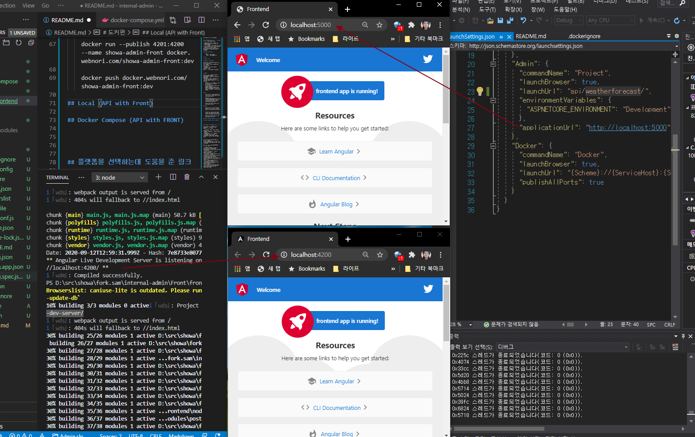

# 모던웹

모던웹 컨셉이 반영된 어드민 웹개발 템플릿

## 개발 컨셉

### 기능개발과 UI개발의 분리

- WebApi : API개발자는 DB를 이용및 협업하여 백엔드 기능개발에 집중함과 동시에 Front가 사용할수 있는 기능을 제공해야함
- FrontAPP : 프론트 개발자는 API를 이용하고, UI/UI컴포넌트 UX 개발에 집중

API와 Front를 분리개발하는 최근 활용되고 있는 모던한 웹 개발방식으로
언어및 플랫폼 조합구성을 자유롭게 진행할수 있습니다.

ex>
- API를 SpringBoot(JAVA)로 변경가능하고
- 반대로 Front를 쉽게 교체도 가능합니다. 이것은 각기다른 언어를 인정하는 MSA의 지향점과도 일치합니다.
- 하지만 궁극적인 이점은, API 기능 개발을 먼저하고 Front를 이후에 적용할수도 있습니다.

## Application LayOut

    root
        Admin : Admin API 프로젝트로 .net core api 작성되어짐
        Front : 순수 프론트 코드만 존재하며 Angular.js로  작성되어짐

백엔드와 프론트의 역활이 비슷한 구성요소의 네임스페이스를 
다음과 같이 단일화 하였으며, 어드민 도메인 기능을 작동하기 위한
핵심 구성 요소입니다.

- Repositories : 데이터베이스 컬렉션을 흉내내는 조회를포함, CRUD 수행하는 객체입니다. (레파지토리 패턴을 추천)
- Models : Entity,원격으로 주고받는 데이터 전송객체등 순수 모델을 정의한 객체입니다. (POJO,POCO) 
- Services : 주로 Stateless한 기능을 제공하며, 다양한 어댑터를 활용하거나 포함할수 있습니다.
- Components : UI를 표현하는 Html/CSS가 포함된 컴포넌트이며, Service를 이용하여 상호작용(UX) 합니다.

## Hexagoanl

궁극적으로 지향하는 전체시스템의 클린 아키텍쳐는, 헥사고널 입니다. 

어댑터를 사용하여 육각형으로 연동되는 클린 아키텍쳐로, 

전통적으로 백엔드와 프론트라는 수직적 관계 형성이 아닌, 특정 프론트조차 헥사고날의 하나로서

수평적으로 상대의 어댑터와 연동되어 확장될수 있는 컨셉입니다.

이것이 의미하는 숨은 의미는, 프론트 개발역시 OOP(TS)를 활용하여,표준적인 패턴(DI등)을 사용하고 

수준있는 어플리케이션을 구성해야 함을 의미합니다.  

### 분리에따른 웹리소스 빌드 - WebPack

- 규모가 있는 시스템은 다양한 js/css/image가 필요하며 이것을 효율적으로 관리해야합니다.
- 빌드된 리소스는 미들웨어에 포함될수도 있으며, 완전하게 독립될수도 있습니다.
- 최종목표는 리소스를 압축하고 단일화하여 네트워크 트래픽을 줄임과 동시에 성능 최적화의 목적을 가지고 있습니다.
- 모던 웹(Angula/Vue/React)에서 Webpack을 활용한 CLI툴이 사용됩니다.

# 로컬 실행편

로컬에서는 각각 편한 CLI 방식을 사용하면 되겠습니다.

# API 실행 : 5000port ( api 서버에서 프론트 proxy를 내장합니다.)

    Development : 로컬로 모두 해결되는 올인원 로컬방식
    AlphaLocal : 특정 로컬 원격DB 연결이 필요할시

- Run : Admin> dotnet run --environment "Development"
- Run : Admin> dotnet run --project Admin --environment "AlphaLocal"

관련 Proxy 코드
Proxy를 Webpack에서 수행하여 반대로 작동가능하지만, 여기서는 API서버가 Proxy역활을 하도록 하였습니다.
Proxy를 백엔드/프론트 어느지점에서 더 유리한지는 각각 다를수 있으며 따라 유연하게 변경가능합니다.

    using (var serviceScope = app.ApplicationServices.GetService<IServiceScopeFactory>().CreateScope())
    {
        var appSettings = serviceScope.ServiceProvider.GetRequiredService<AppSettings>();
        app.UseSpa(spa =>
        {
            // To learn more about options for serving an Angular SPA from ASP.NET Core,
            // see https://go.microsoft.com/fwlink/?linkid=864501
            spa.Options.SourcePath = "ClientApp";
            spa.UseProxyToSpaDevelopmentServer(appSettings.ClientProxy);
        });
    }

# Front 실행 : 4200port

    Front/frontend> npm install
    Front/frontend> ng serve -o

# 도커편

독립된 빌드를 지원하며, 필요하면 동일인스턴스에 뛰우는것
다른 버전의 빌드조합으로 뛰우는것이 가능합니다. 
다른 버전빌드 조합은, 예상치 못한 재현불가 운영 작동문제가 발생할시 문제되는 버전을 찾는데 도움이 될수 있습니다.
    

## API

    docker build -f Admin/Dockerfile --force-rm -t webnori-admin-api:dev .

    docker run -e ASPNETCORE_ENVIRONMENT=Development --publish 5000:5000 --name webnori-admin-api:dev

## FRONT

    Front\frontend> 에서수행

    docker build -f Dockerfile --force-rm -t webnori-admin-front:dev .

    docker run --publish 4201:4200 --name webnori-admin-front:dev
    

## Local (API with Front)

4200 : Fornt Atand Alone으로 작동가능합니다
5000 : 닷넷코어에서 프론트 Proxy가 설정되어, API서버에서도 프론트 동작 확인가능하며, 실제 운영 미들웨어는 닷넷코어가 담당합니다.

webpack의 기능을 활용하면서, 어드민이 동일한 도메인으로 작동가능하기때문에
로컬환경에서 크로스 도메인문제를 피할수 있습니다.

Tip : 도메인이 같더라도 포트가 다르면 크로스도메인입니다.

- localhost:5000/api/기능 : API개발자는 API개발에집중
- localhost:5000/나머지 : 프론트개발자는 프로트에집중 / 가끔 API개발자가 프론트확인도 가능

## Docker Compose (API with FRONT)

왜 Docker Compose 인가?

- 로컬 개발환경 디버깅에서 사용한 환경구성이 개발,운영 모두 일관성있게 사용가능합니다.
- 인스턴스내 복수개의 인스턴스가 단일 서버인것처럼  운영가능
- 필요하면 각각 다른 전략으로 스케일 아웃이 가능합니다. (Ex> API3,Front 10 )
- 쿠버의 Pod에 해당하는 컨셉으로, yml형식이 유사하며, 쿠버네티스로의 전환도 용이해지며 중간준비단계가 될수 있습니다.

진정한 궁극기는, 도커컴포져로 셋팅될시 한앱처럼 웹앱이 작동 가능한상태에서
프론트만 업데이트를 할수 있는 전략을 펼칠수 있습니다.
독립적으로 각각 기능개선을 할수있습니다.

## 플랫폼을 선택하는데 도움을 준 링크

단일 시스템으로 작성된것을, 분리하여 개발하는 것은 협업방법과 함께
일반적으로 더 섬세한 데브옵스 기술수준이 요구됩니다.
아래 기술 아티컬을 읽어보시는 것을 권장합니다.

참고링크 : 이 구성을 완성하기위해 참조가된 아티클

- 백+프론트 도커전략 : https://espressocoder.com/2020/02/05/adding-docker-to-the-asp-net-core-angular-template/
- Docker with Angular : https://mherman.org/blog/dockerizing-an-angular-app/
- Asp.netCore + angular : https://www.c-sharpcorner.com/article/introduction-to-building-asp-net-core-and-angular-web-application/
- 모던웹 기술블로그 : http://wiki.webnori.com/display/webfr/Angular+with+NetCore+3.1
- 웹팩 : https://nesoy.github.io/articles/2019-02/Webpack
- 웹팩+angular : https://developer.okta.com/blog/2019/12/09/angular-webpack
- SPA : https://docs.microsoft.com/en-us/aspnet/core/client-side/spa/angular?view=aspnetcore-3.1&tabs=visual-studio
- 

## 기술지원

모던웹 관련된 기술문의 언제든 환영입니다.

메일 문의 : psmon@live.co.kr

여기서 연구되는 자료는 실제 개발팀에서 MSA 모던한 웹서비스 개발에서 활용하고 있으며

관심있는 개발자는 아래 링크를 통해 지원가능합니다. ( Vue/React/Angular중 하나에 자신있으신분 )

[지원GOGO](https://lunasoft.co.kr/home/main/page/company/recruit)
